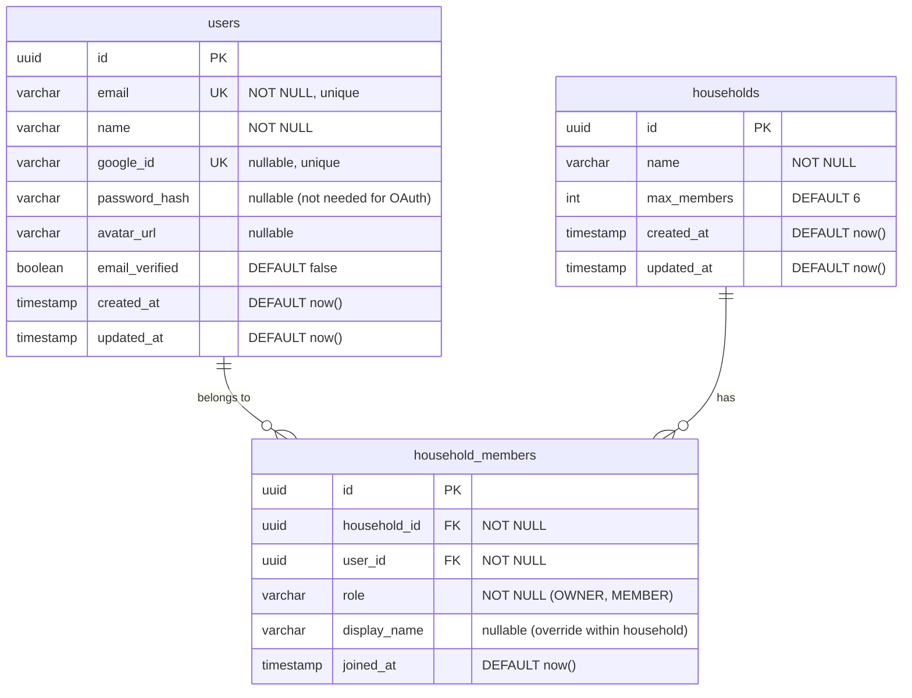
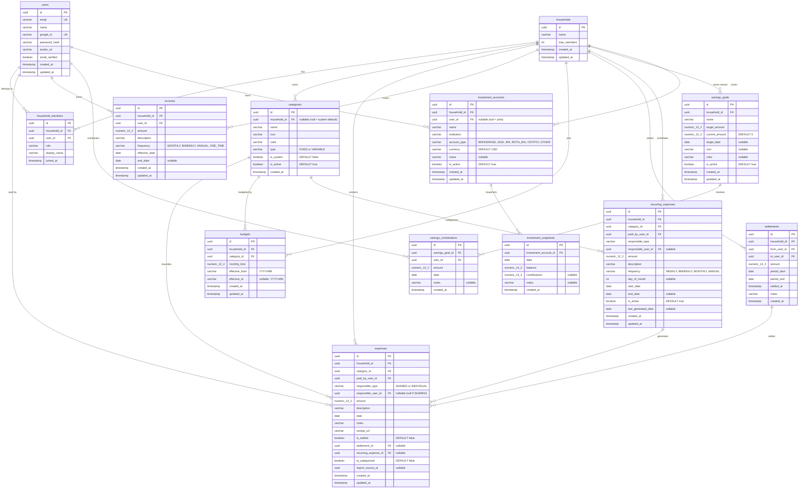

# MoMoney — Entity Relationship Diagrams

## Phase 1: Foundation (Users, Households, Members)

### Phase 1 Notes
- A user can belong to **multiple households** (e.g., one with partner, one with roommates)
- Each `household_members` row links a user to a household with a role
- `OWNER` can manage settings, invite/remove members; `MEMBER` can add expenses and view data
- `display_name` lets a user go by a different name per household (nullable, falls back to `users.name`)
- `google_id` and `password_hash` are both nullable — a user has one or both depending on auth method
- Unique constraint on `(household_id, user_id)` prevents duplicate membership

---

## Full Vision: All Entities

### Relationship Summary

| Relationship | Type | Notes |
|---|---|---|
| User -> HouseholdMember | One-to-Many | A user can be in multiple households |
| Household -> HouseholdMember | One-to-Many | A household has up to `max_members` members |
| Household -> Category | One-to-Many | System categories have `household_id = NULL` |
| Household -> Expense | One-to-Many | All expenses scoped to a household (tenant isolation) |
| Household -> Income | One-to-Many | Income per user per household |
| Household -> Budget | One-to-Many | Budgets per category per month |
| Household -> Settlement | One-to-Many | Settlements between two users in same household |
| Household -> RecurringExpense | One-to-Many | Templates that generate expenses |
| Household -> SavingsGoal | One-to-Many | Shared or individual savings goals |
| Household -> InvestmentAccount | One-to-Many | Individual or joint accounts |
| Category -> Expense | One-to-Many | Every expense has a category |
| Category -> Budget | One-to-Many | Budgets target a specific category |
| User -> Expense (paid_by) | One-to-Many | Who actually paid |
| Settlement -> Expense | One-to-Many | Which expenses a settlement covers |
| RecurringExpense -> Expense | One-to-Many | Auto-generated expense records |
| SavingsGoal -> SavingsContribution | One-to-Many | Contributions toward a goal |
| InvestmentAccount -> InvestmentSnapshot | One-to-Many | Point-in-time balance records |

### Key Constraints
- **Tenant isolation**: Every query scoped by `household_id` at the repository layer
- **Money types**: `NUMERIC(12,2)` for expenses/income/budgets, `NUMERIC(14,2)` for investment balances
- **Soft deletes**: Categories use `is_active` flag (never hard delete, preserves history)
- **Unique constraints**: `(household_id, user_id)` on `household_members`, `email` and `google_id` on `users`
